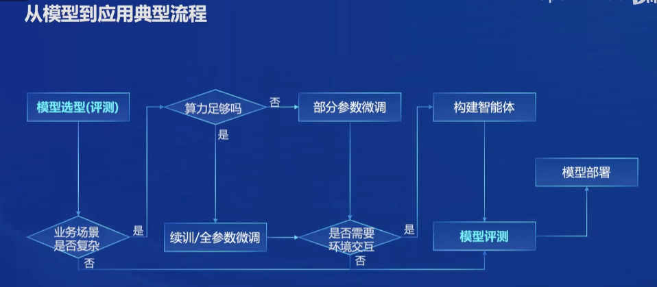
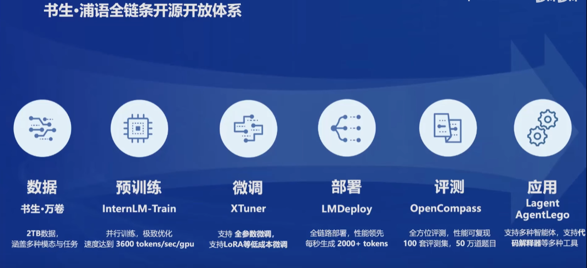
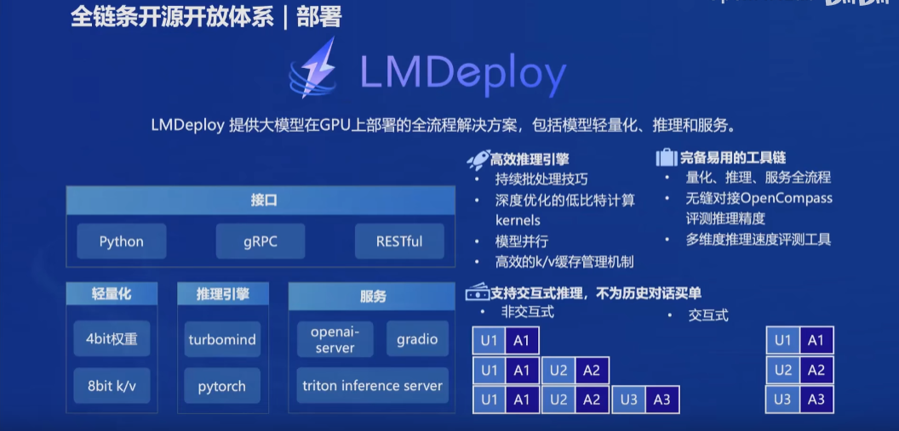

## 一、浦语大模型

#### 1、提供7B和20B不同尺寸
#### 2、InternLM2-Base，InternLM2，InternLM2-Chat。

## 二、模型到应用的流程

## 三、书生浦语开源了全链条工具体系: 包括数据、预训练、微调、部署、评测、应用等环节。

### 1、数据集: 书生万卷，2TB数据，有文本、图像、视频数据，符合中国价值观。
### 2、预训练: 高可拓展性、性能优化、兼容生态、开箱即用。
### 3、微调XTuner: 适配各种生态，适配各种硬件，模型微调，提升模型效果。
### 4、部署LMDeploy: 模型部署，提供多种部署方式。

### 5、Open Compass 2.0思南大模型评测体系
#### 评测框架: 开发和开源，建立评测基准社区。
#### 优化: 允许更多精力投入到数据准备和优化。
#### 适配: 已适配超过100个评测集，是国内最完善的评测体系之一。
### 6、应用: 
#### Lagent 智能体框架支持多种智能体能力
#### AgentLego 多模态智能体工具箱